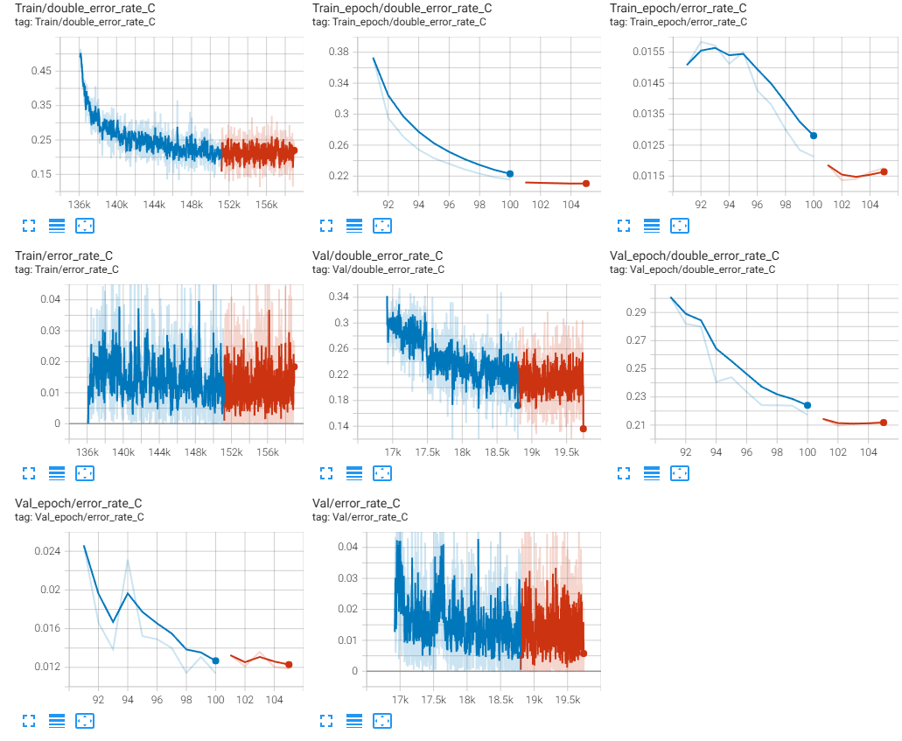
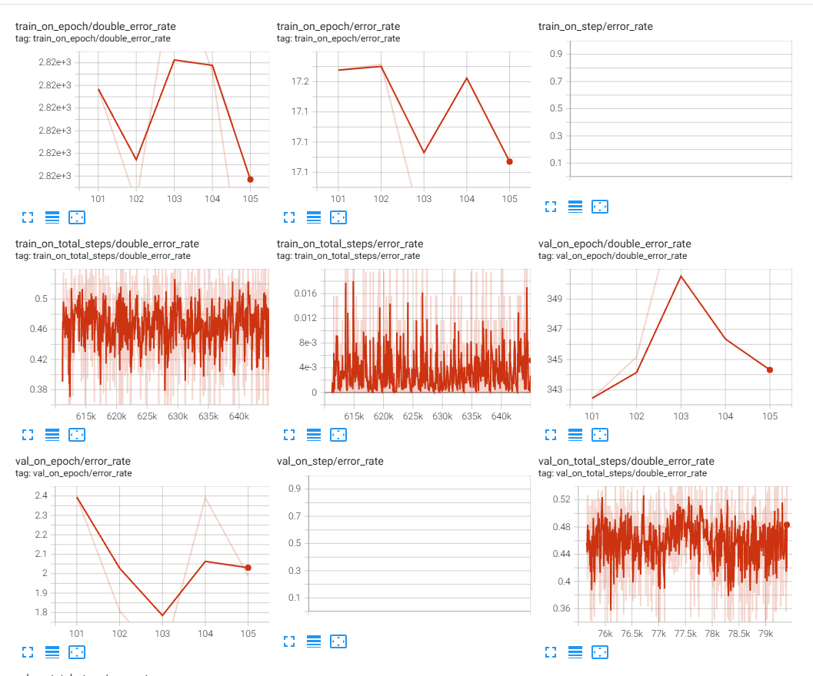

# 双重水印攻击实验

## 需要得到的实验结果

1. 需要使用统一的数据集
1. 分别对于水印模型微调前、后执行：
    1. 二次编码后，信息解码比特错误率（BER，二次解码信息与一次编码信息的差距）
    1. 二次编码后，图像的 PSNR、SSIM 变化，如果方便的话，最好加上 LPIPS 变化
    1. 一次编码时的图像、二次编码时的图像、一次编码的信号残差、二次编码时的信号残差

## 计划实验的模型

1. SepMark。向图像中注入的水印可以供两个不同鲁棒性程度的解码器解码（Tracer 解码出完整水印验证来源，Detector 验证图像是否被篡改）。只针对 Detector 即可。

## 备注

1. AdvMark 并没有验证其方法对于模型的普遍性，只是验证了检测器的流通性。
1. 冻结 encoder，只微调 decoder，这样就可以测试不同水印模型之间的流通性。
1. 用非入侵式的方法来增加微调模块。新建一个 fine_tuning 文件夹，用继承的方式修改需要重写的方法。尽量把所有的东西都放到该 fine_tuning 文件夹中（除了跑通原模型所必要的数据集之类的）。这里需要注意 Python 包导入的问题，在 fine_tuning 文件夹中导入原模型的包因使用**绝对导入**，导入 fine_tuning 文件夹的内容则使用**直接导入**

## SepMark

### 实验目的

本次实验需验证三点：

- **双重水印攻击是有效的**。即对于同一张图片，第二次编码将使得第一次编码的信息消失；
- **提出 Loss 约束在全量微调下是有效的**。即能够解决双重水印攻击；
- **部分微调是可行的**。或者说仅针对解码器微调、而不进行全量微调是可行的；

### 实验结果

无微调/微调对比（Epoch 100）

|    |    g_loss |   error_rate_C |   error_rate_R |   error_rate_F |    psnr |     ssim |   g_loss_on_discriminator |   g_loss_on_encoder_MSE |   g_loss_on_encoder_LPIPS |   g_loss_on_decoder_C |   g_loss_on_decoder_R |   g_loss_on_decoder_F |   d_loss |   g_loss_on_double_watermark |   double_error_rate_C |   double_error_rate_R |   double_error_rate_F |
|---:|----------:|---------------:|---------------:|---------------:|--------:|---------:|--------------------------:|------------------------:|--------------------------:|----------------------:|----------------------:|----------------------:|---------:|-----------------------------:|----------------------:|----------------------:|----------------------:|
|  未微调 | 1.1644    |     0.00691318 |    0.000124139 |       0.478008 | 38.7788 | 0.938527 |                   2.03329 |             0.000531517 |                0.00808962 |           0.000523669 |           0.000302436 |           1.08015e-06 |  2.00961 |                   0.114804   |            0.498312   |              0.500698 |              0.487456 |
|  微调 | 0.0316224 |     0.00481385 |    6.89663e-05 |       0.485183 | 38.3354 | 0.929688 |                   2.12371 |             0.000589209 |                0.00874837 |           0.000439849 |           0.000251798 |           5.70558e-07 |  1.95333 |                   0.00159519 |            0.00129381 |              0        |              0.493148 |

上表足以说明：

- **双重攻击确实有效**
- **提出 Loss 约束在全量微调下是有效的**

经过对 MBRS 和 SepMark 的编码器冻结实验，结果如下：

SepMark 冻结编码器，只微调解码器：



MBRS 冻结编码器，只微调解码器（有些 error_rate 数据有误，只看 double_error_rate 即可）：



可以发现 SepMark 的双解码错误率虽有下降，但是最后在 10%~20% 之间趋于平缓；而 MBRS 的双解码错误率则完全没有下降。始终在随机猜测的概率（50%）处波动。

其实也容易想得通，双重编码时编码器已经破坏了原有的信息，无论再怎么训练解码器，也不可能恢复了。所以：

- **部分微调解码器是不可行的**

但还没有尝试部分微调编码器，期望让编码器学习到只要图像中有水印，就无需再编码的规则。

### 实验过程

在 `network/Dual_Mark.py` 的第 200 行左右，添加如下损失行：

```Python
# ======================= Double watermarking ====================== #
double_message = torch.Tensor(np.random.choice([-1.0, 1.0], (images.shape[0], 128))).to('cuda')
double_encoded_images, double_noised_images, double_decoded_messages_C, double_decoded_messages_R, double_decoded_messages_F = self.encoder_decoder(encoded_images, double_message, masks)
g_loss_on_double_watermark = (
	self.criterion_MSE(double_encoded_images, encoded_images) + 
	self.criterion_MSE(double_decoded_messages_C, decoded_messages_C)*5 + 
	self.criterion_MSE(double_decoded_messages_R, decoded_messages_R) + 
	self.criterion_MSE(double_decoded_messages_F, decoded_messages_F)
```

添加 Loss 后，从 Epoch 91 （包含 Epoch 91）训练至 Epoch 100。**在测试集上 error_rate_C 依然在 50% 附近**，这说明该 Loss 似乎没有作用（后发现实际上是因为测试代码有问题，且未找出测试代码出问题的原因。实际上，不管是不是由于测试代码有问题，这里的 Loss 这么写都是不合适的，应当先按照下面的方式重新写 Loss）。

猜测失败原因：约束第一次解码信息和第二次解码信息相同，但第一次解码信息本身又不一定准确。

解决方案：约束第一次 **编码** 信息和第二次解码信息相同，同时赋予权重。把添加的 Loss 修改为：

```Python
double_message = torch.Tensor(np.random.choice([-1.0, 1.0], (images.shape[0], 128))).to('cuda')
double_encoded_images, double_noised_images, double_decoded_messages_C, double_decoded_messages_R, double_decoded_messages_F = self.encoder_decoder(encoded_images, double_message, masks)
g_loss_on_double_watermark = (
    self.criterion_MSE(double_encoded_images, encoded_images) + 
    self.criterion_MSE(double_decoded_messages_C, messages)*5 + 
    self.criterion_MSE(double_decoded_messages_R, messages) + 
    self.criterion_MSE(double_decoded_messages_F, torch.zeros_like(messages))
)
```

[2025-03-06]

训练结束后，修改 `test_Dual_Mark.py` 代码，使其编码两次水印，运行得到的 error_rate_C 依然很高（50% 左右浮动）。但是如果借助模型的 `validation()` 函数在测试集上运行，则结果正常：

```Python
with tqdm(total=len(val_dataloader)) as pbar:
    for step, (image, mask) in enumerate(val_dataloader, 1):
        image = image.to(device)
        message = torch.Tensor(np.random.choice([-message_range, message_range], (image.shape[0], message_length))).to(device)

        result_origin, (images, encoded_images, noised_images) = network_origin.validation(image, message, mask)
        result_double_watermark, (images, encoded_images, noised_images) = network_double_watermark.validation(image, message, mask)

        for key in result_origin:
            test_result_origin[key] += float(result_origin[key])
            test_result_double_watermark[key] += float(result_double_watermark[key])
        
for key in result_origin:
    test_result_origin[key] /= len(val_dataloader)
    test_result_double_watermark[key] /= len(val_dataloader)
pd.DataFrame([test_result_origin, test_result_double_watermark], index=[0]).to_markdown("test_result.md")
```

猜测是 `test_Dual_Mark.py` 代码的问题，暂未找到原因。不过好在终于可以在测试集上检验微调效果。

[2025-03-10]

现在发现是 tmd 第二次生成的 message 的 message_range 错了，没有使用配置中的值，而是当时凭借记忆写了一个值 1，其实应该是 0.1。

```Python
double_message = torch.Tensor(np.random.choice([-1.0, 1.0], (images.shape[0], 128))).to('cuda')
double_message = torch.Tensor(np.random.choice([-message_range, message_range], (images.shape[0], 128))).to('cuda')
```

## MBRS

### 实验目的

- 拿到微调前和微调后的 psnr、ssim、lpips、ber 数据
- 测试冻结编码器，只微调解码器是否可行

### 实验结果

### 实验过程

可恶的作者没有提供预训练好的模型，只能在 SepMark 的数据集上自己重新训练。不过这次实验确定了要保留的实验数据，而像信号残差这种需要放图片的，由于不可能把所有的都放上去，所以最后肯定是放一两个就可以了，既然如此就到时候再说。

[2025-03-11]