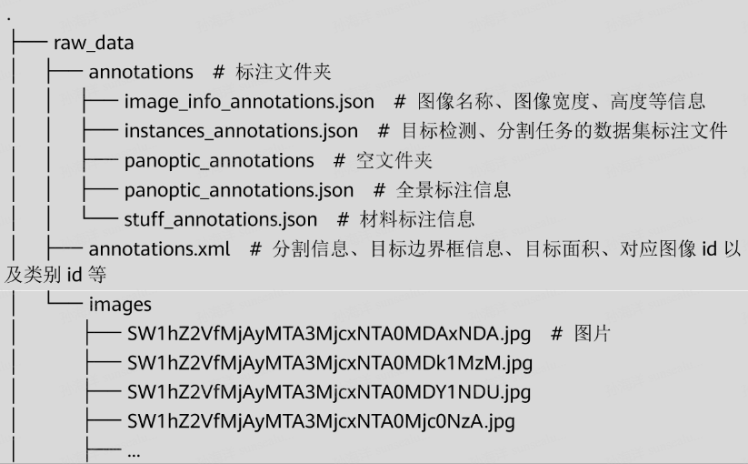
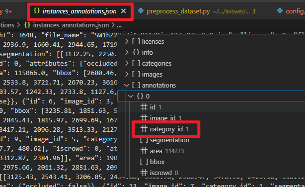
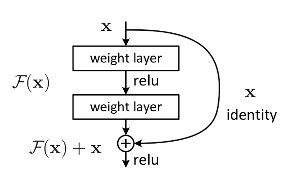
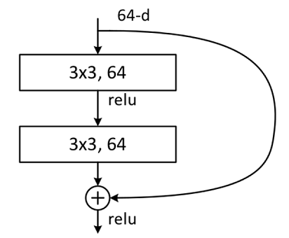
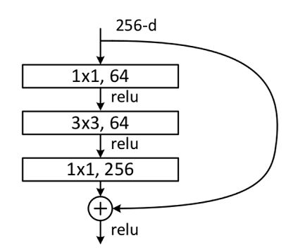
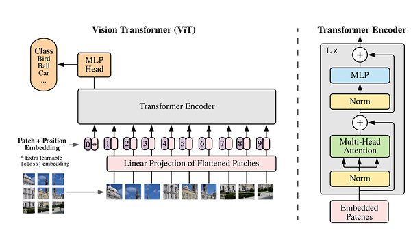
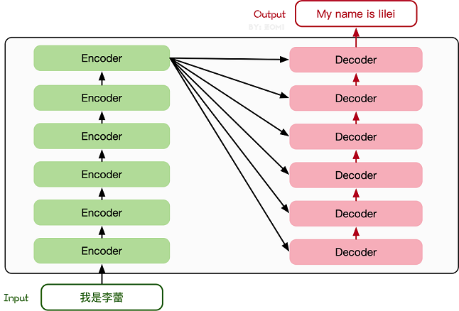
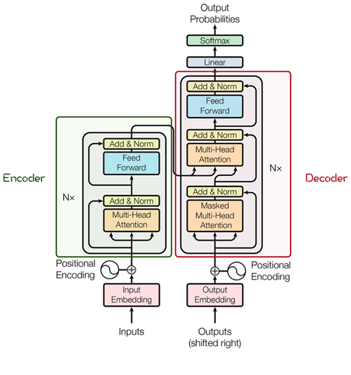

# ICT 实验笔记

## 2024 年国赛试题 MindSpore 部分内容研究

### 任务一

主要目的是训练一个可以识别开发板上能够标出蓝色区域的模型。


- **考点一** 实验云环境准备

即在 ModelArts 的 [Notebook](https://console.huaweicloud.com/modelarts/?region=cn-north-4#/dev-container) 下购买 Notebook 实例，按照其要求配置环境。

- **考点二** 填写数据预处理部分的缺失代码

!!! tip "预说明的部分" 
    实验数据集分为原始数据集和预处理后的数据集

    - 原始数据集为 raw data，属于 coco 格式数据集，包含图片 image 以及 annotation 文件。原始数据集不能直接使用，需要经过数据预处理。
    - 预处理后的数据集为 data，存放预处理后的数据集，包含图片 image 和标签 mask，用于模型训练和推理。

    raw_data 的目录结构：

    

首先是填写 `preprocess_dataset.py` 的三处空缺。第一处空缺如下：

```Python
#1、填写参数标签
#------------------**************
anno_json =   # annotaion json文件路径
coco_cls =   # 数据类别80+1类的名字
coco_dir =   # 数据集路径
save_dir =   # 最终结果保存路径    
#--------------------***********************
```
    
```Python
if __name__ == '__main__':
    parser = argparse.ArgumentParser(description='Train the UNet on images and target masks',
                                     formatter_class=argparse.ArgumentDefaultsHelpFormatter)
    parser.add_argument('-d', '--data_url', dest='data_url', type=str, default='data/',
                        help='save data directory')
    args = parser.parse_args()
    preprocess_dataset(cfg_unet, args.data_url)
```

可以看到程序首先执行到 `preprocess_dataset()` 函数，如下：

```Python
def preprocess_dataset(cfg, data_dir):
    """Select preprocess function."""
    if cfg['dataset'].lower() == "cell_nuclei":
        preprocess_cell_nuclei_dataset({"data_dir": data_dir})
    elif cfg['dataset'].lower() == "coco":
        if 'split' in cfg and cfg['split'] == 1.0:
            train_data_path = os.path.join(data_dir, "train")
            val_data_path = os.path.join(data_dir, "val")
            train_param_dict = {"anno_json": cfg["anno_json"], "coco_classes": cfg["coco_classes"],
                                "coco_dir": cfg["coco_dir"], "save_dir": train_data_path}
            preprocess_coco_dataset(train_param_dict)
            val_param_dict = {"anno_json": cfg["val_anno_json"], "coco_classes": cfg["coco_classes"],
                              "coco_dir": cfg["val_coco_dir"], "save_dir": val_data_path}
            preprocess_coco_dataset(val_param_dict)
        else:
            param_dict = {"anno_json": cfg["anno_json"], "coco_classes": cfg["coco_classes"],
                          "coco_dir": cfg["coco_dir"], "save_dir": data_dir}
            preprocess_coco_dataset(param_dict)
    else:
        raise ValueError("Not support dataset mode {}".format(cfg['dataset']))
    print("========== end preprocess dataset ==========")
```

由于题目说数据集是 coco 格式，所以程序会执行 `preprocess_coco_dataset()` 会分别以 train_param_dict、val_param_dict、param_dict 作为参数调用。

由此已经可以明确函数 `preprocess_coco_dataset()` 的参数是 dict() 类型，所以第一个缺失答案如下：

```Python
#1、填写参数标签
#------------------**************
anno_json = param_dict["anno_json"]   # JSON格式标注文件路径
coco_cls = param_dict["coco_classes"] # 数据类别80+1类的名字
coco_dir = param_dict["coco_dir"]     # 数据集路径
save_dir = param_dict["save_dir"]     # 最终结果保存路径
#--------------------***********************
```


第二处空缺如下：

```Python
coco_cls_dict = {}  # key为类名，value为索引值
for i, cls in enumerate(coco_cls):
    
    # 2、补全该处代码
    #------------------**************    
    coco_cls_dict[xxx] =   # eg:{'backgroud':0, 'person':1',...}
    #------------------**************
```

填空 1 处，说 coco_cls 是 *数据类别80+1类的名字*，遍历变量中，i 逐渐递增，cls (class 的缩写) 是类别名。

需要补全处的注释又说明 key-value 中的 key 应该是名字，而等于的值又是数字，所以应该是 `coco_cls_dict[cls] = i`。所以第二处缺失答案如下：

```Python
# 2、补全该处代码
#------------------**************
coco_cls_dict[xxx] =   # eg:{'backgroud':0, 'person':1',...}
#------------------**************
```

第三处空缺如下：

```Python
#3、补全该处代码
#------------------**************
for instance in anno:
    m = annToMask(   )  # h*w的array
    c = coco_cls_dict[ ]  # 最里层为此分割物体属于哪类。class_dict把idx转成类名，cls_dict把类名转回idx
    if len(m.shape) < 3:
        mask[:, :] += () * ( * )  # 当前属于背景的mask=0，与得到的物体的矩阵m，对应位置上标记为类别c
    else:
        mask[:, :] += () * (((  * c).astype(np.uint8)  # 将3d转成2d,做上面类似的操作
#------------------**************
```

第一个函数 annToMask() 意思即将标注转化为 mask，函数体如下：

```Python
def annToMask(ann, height, width):
    """Convert annotation to RLE and then to binary mask."""
    from pycocotools import mask as maskHelper
    segm = ann['segmentation']  # 前景边界点，对应coco rle格式
    if isinstance(segm, list):
        rles = maskHelper.frPyObjects(segm, height, width)
        rle = maskHelper.merge(rles)
    elif isinstance(segm['counts'], list):
        rle = maskHelper.frPyObjects(segm, height, width)
    else:
        rle = ann['segmentation']
    m = maskHelper.decode(rle)
    return m
```

即函数 annToMask() 输入标注 ann，height 和 width，输出 mask。由于 for 循环里遍历变量为 instance，所以确定第一个参数应该是标注，即 instance。后面的高和宽，可以看到前面几行有变量 h 和 w 的赋值，这里除了填它俩也没什么别的可填的了，因此第 4 行答案是 `m = annToMask(instance, h, w)`。

第 5 行给出的提示说：*class_dict把idx转成类名，cls_dict把类名转回idx*。同时，借助代码补全插件 FittenCode，给出的提示为 `classs_dict[instance["category_id"]]`。猜测我们需要知道 instance 对应 json 文件的键值，打开 `raw_data/annotations/instances_annotations.json`，如下：



这说明 AI 给出的提示准确无误，即第 5 行答案为：`c = coco_cls_dict[instance["category_id"]]`。剩下的空缺较难，假设比赛时没有 coco 数据集处理相关的知识，感觉根本无法做出来。至于 `src/config.py` 下的参数，答案基本是按照 `train.py` 中的默认值来填的，这就很奇怪...如果你是默认值的话，那为什么还要在配置文件里声明一下？

- 考点 3：完成 `unet` 网络模型挖空部分，训练并保存权重，以生成权重文件为准

第一处空缺，由于只需要区分是蓝色区域，因此分类类别为 2，这与前面的配置文件中的填写一致。

```Python
def __init__(self, in_channel, n_class=2, feature_scale=2, use_deconv=True, use_bn=True):
```

第二处空缺，可以参照上方函数 `NestedUNet` 如何对通道数进行缩放。这段代码是为了方便修改输入、输出通道数而设置的，feature.scale 类似于[这里](https://www.mindspore.cn/tutorials/zh-CN/r2.5.0/cv/transfer_learning.html) `ResidualBlockBase` 的 `expansion` ，因此该空缺填写如下：

```Python
filters = [int(x / self.feature_scale) for x in filters]
```


## 实践案例

### 计算机视觉

#### ResNet 50 图像分类

ReNet 主要解决的问题：减轻网络层数增加时，模型的退化问题。大致结构如下：



ResNet 有两种网络结构，一种是 Building Block，一种是 Bottleneck Block。Building Block 大致结构如下：



Bottleneck Block 大致结构如下：



#### Vision Transformer

Transformer 是自然语言处理模型的发展结晶，ViT 则是自然语言处理和计算机视觉两个领域的结晶。在**不依赖卷积操作的情况下**，仍能达到较好的效果。

ViT 的主体结构：



先解释 Transformer 的基本原理。下图中的网络结构是由 Transformer 编码器和解码器组成的：



其中的编码器和解码器详细结构如下：



这其中最重要的就是 Multi-Head Attention，该结构基于自注意力机制，是多个 Self-Attention 的并行组成。**理解 Self-Attention 就抓住了 Transformer 的核心**。

Self-Attention 的核心内容是为输入向量的每个单词学习一个权重。

